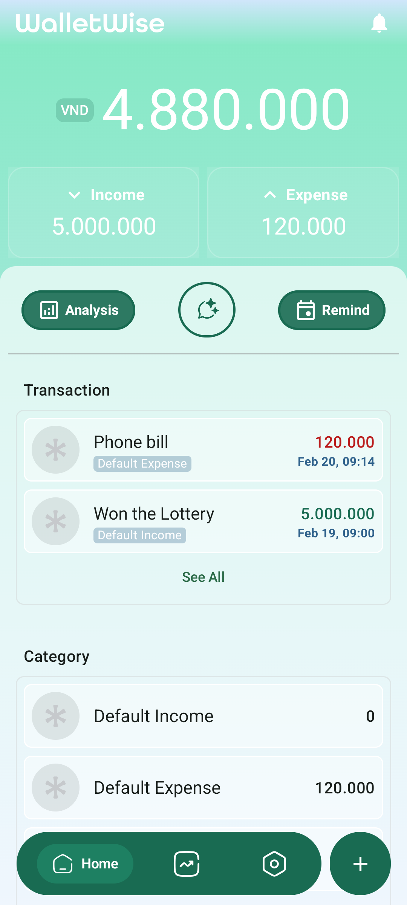

# xWalletWise - A Personal Finance Tracker

<table>
  <tr>
    <td></td>
    <td></td>
    <td></td>
  </tr>
</table>

## Description
WalletWise is a personal finance management application built with Kotlin and Jetpack Compose. It aims to help users track their income and expenses, set budgets, and generate reports. This project serves as a learning experience for exploring modern Android development concepts and practices.

## Project Background
This project is an extension of a previous group project completed for a university course. You can find the original project repository here: [HCMUS SE4AI WalletWise CSC10011](https://github.com/baohuyvanba/hcmus_se4ai_WalletWise_CSC10011). I continue developing the application to deepen my understanding of Android development with Kotlin, Jetpack Compose, and other modern technologies.

## Features
- [x] Track income and expenses
- [x] Categorize transactions
- [x] Set budgets
- [ ] Generate customizable reports
- [ ] ...

## Tech Stack
- **Language**: Kotlin - Modern programming language for Android development.
- **UI**: Jetpack Compose (Material)
  - Declarative UI framework for building responsive and beautiful user interfaces.
- **DI**: Hilt
  - Dependency injection library for managing dependencies throughout the application.
- **Local DB**: Room
  - Persistence library for storing and retrieving data locally.
- **Concurrency**: Kotlin coroutines/Flow  
- **Navigation**: (Compose Navigation pattern)  

## Architecture
This project follows a MVVM architecture to separate concerns and improve maintainability.

## Project Structure
The app is organized around a Compose-first, MVVM setup with a single-Activity entry, a root composable, a main `Scaffold` layout, and a Navigation Host that control all screens's navigations.

  

**Diagram description (EN):**
- **WalletWiseActivity** — the app entry point. Requests runtime permissions and sets the UI content to `XWalletWise()` under `WalletWiseTheme`.
- **XWalletWise** — the root composable that holds the entire app UI.
- **Scaffold** — provides the overall layout: a `TopBar` (placed in the upper column), a floating bottom bar/action (lower column), and the **Navigation Host**.
- **WalletWiseNavHost** — the navigation graph. It declares `composable` destinations with `route` names and screen transitions (`enterTransition`, `exitTransition`, `popEnterTransition`). Each route maps to a `Screen`.
- **WalletWiseDestination** — holds destination metadata (route name and icon) used by the NavHost/UI to render and navigate consistently.

## Additional Information
This project is still under development. New features and improvements are continuously being added.
The project relies on some functionalities not included in this README (e.g., manifest permissions). Please refer to the codebase for the complete picture.

**License**: No explicit open-source license is defined yet. Until a license is added, all rights are reserved by the author. If you intend to use the code, please open an issue to discuss.

**Disclaimer**: This app is built for learning and educational purposes. It is not financial advice or a substitute for professional tools. Use at your own discretion and always keep backups of important data.
